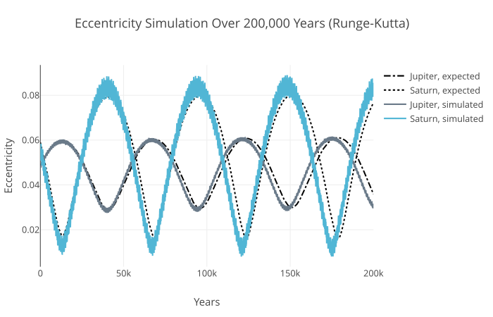
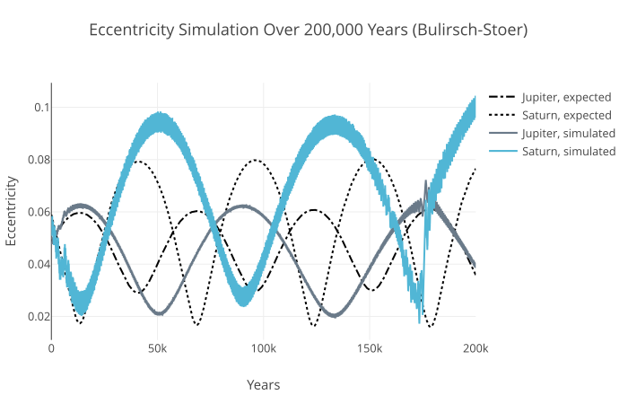

# Bulirsch-Stoer Instability in ORSA with Java Plotly Visualisation

This repository holds digital resources associated with the article
"Bulirsch-Stoer Instability in ORSA with Java Plotly Visualisation"
[[1](#references)]. That article discusses numerical instability of the
Bulirsch-Stoer algorithm, as implemented in the legacy GUI application Orbit
Reconstruction, Simulation and Analysis (ORSA). The instability was
demonstrated with Plotly visualisation tools, called from Java.

 
<table>
<tr>
<td>
<figure>
  

  <picture><source media="(prefers-color-scheme: dark)" srcset="assets/eccentricity-simulation-with-runge-kutta-dm.svg"></picture>
  <picture><source media="(prefers-color-scheme: dark)" srcset="assets/eccentricity-simulation-with-bulirsch-stoer-dm.svg"></picture>
  

  <figcaption>Figure 1. Eccentricity variation of Jupiter (low amplitude) and Saturn (high amplitude) over 200,000 years, from Runge-Kutta (plot 1) and Bulirsch-Stoer (plot 2) integration in legacy ORSA. Analytical estimates are the dotted lines. Runge-Kutta generally matches estimates. Bulirsch-Stoer diverges. Adapted from [<a href="#references">1</a>].</figcaption>
</figure>
</tr>
</table>

## Table of Contents

- [Key Files](#key-files)
- [Software Requirements](#software-requirements)
- [Quality Assurance](#quality-assurance)
- [Getting Started](#getting-started)
- [Acknowledgements](#acknowledgements)
- [References](#references)

## Key Files

| File                                        | Notes                     |
| :------------------------------------------ | :------------------------ |
| `src/main/java/EccentricitySimulation.java` | Java program.             |
| `src/main/resources/orsa-output.csv`        | Planetary data.           |
| `pom.xml`                                   | Maven configuration file. |

`EccentricitySimulation.java` is a Java program for visualising planetary
orbital element variation with the Tablesaw wrapper for Plotly.

`orsa-output.csv` holds Jovian and Saturnian eccentricity and inclination
evolution data. Some data were calculated via analytical means, and some
simulated using Runge-Kutta and Bulirsch-Stoer integration in ORSA.

## Software Requirements

| Software     | Notes                         |
| :----------- | :---------------------------- |
| Apache Maven | Build automation tool.        |
| Browser      | Program output is HTML files. |
| Java         | Version 26.x required.        |

## Quality Assurance

The repository code has been tested in the following environment.

Windows Test Environment

 

| Type     | Component        | Version                                |
| :------- | :--------------- | :------------------------------------- |
| Platform | Operating system | Windows 11, 25H2 (OS Build 26200.8973) |
| Software | Apache Maven     | 3.9.16                                 |
| &quot;   | Browser          | Microsoft Edge, 151.0.4129.59 (64-bit) |
| &quot;   | Java             | 26.0.1                                 |

## Getting Started

### Apache Maven

The repository assumes Maven is available. The currently installed version of
Maven can be checked from the command line:

    mvn -version

### Java

The repository assumes 26.x is available. The currently installed version of
Java can be checked from the command line:

    java -version

### JAR Build

The repository has been configured for a Maven build of a Java Archive (JAR)
with dependencies. The build should be triggered at the command line, from the
repository root:

    mvn clean package

### JAR Execution

To run the JAR from the command line, from the repository root:

    java -jar target/bulirsch-stoer-instability-jar-with-dependencies.jar

Interactive plots will then be generated and opened in the system's default
browser.

## Acknowledgements

This work was supported by the Australian Research Council Training Centre in
Data Analytics for Resources and Environments (project ICI9010031).

## References

1. T. N. Stenborg, "Bulirsch-Stoer Instability in ORSA with Java Plotly
   Visualisation", in _Astron. Data Anal. Softw. Syst. XXXI_, in Astronomical
   Society of the Pacific Conference Series, vol. 535, B. V. Hugo, R. Van
   Rooyen and O. M. Smirnov, Eds., 2024, pp. 459&ndash;462.\
   [View PDF](https://aspbooks.org/publications/535/459.pdf)
   &nbsp; [View at publisher](https://aspbooks.org/custom/publications/paper/535-0459.html)
   &nbsp; [SciX](https://scixplorer.org/abs/2024ASPC..535..459S/abstract)
